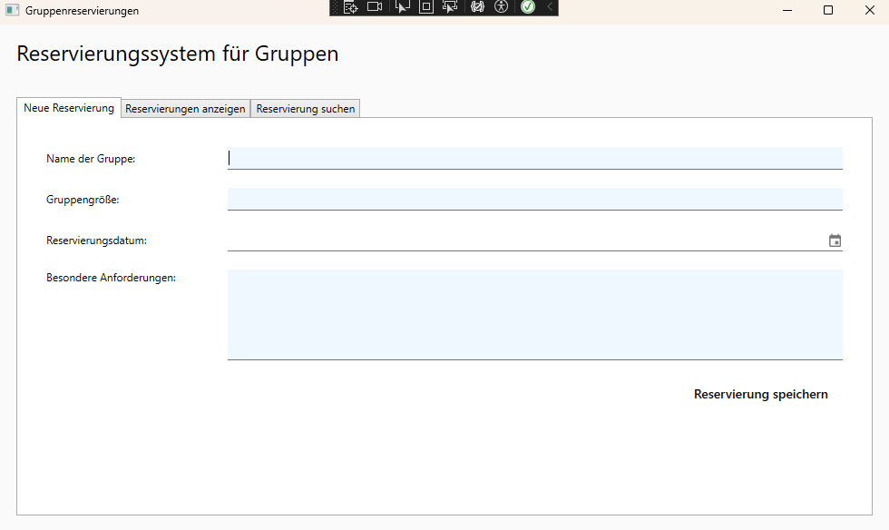
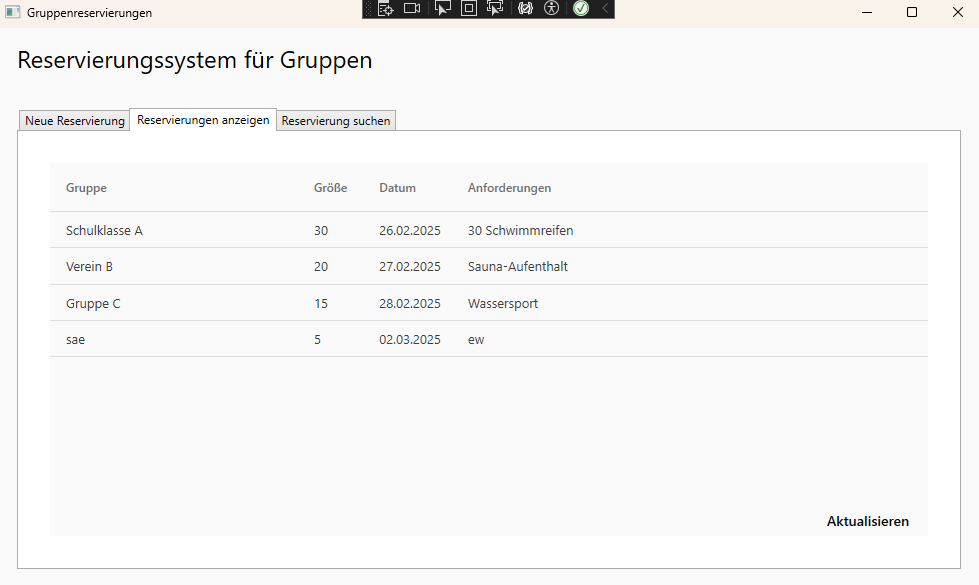
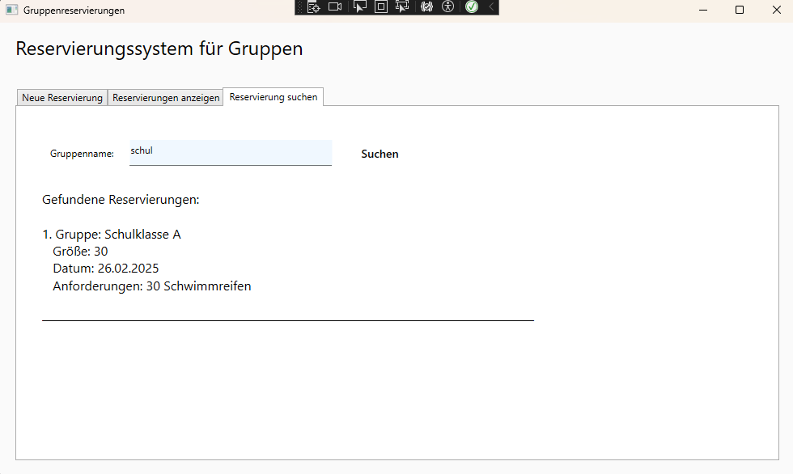

Titel: Reservierungssystem für Gruppen

Autor: Leon Hesch

---

Kurze Beschreibung

Dieses Programm ermöglicht die Verwaltung von Reservierungen für größere Gruppen, zum Beispiel Schulklassen oder Vereine. Es speichert Informationen wie Gruppennamen, Gruppengröße, Reservierungsdatum und besondere Anforderungen in einer Datenbank und bietet folgende Hauptfunktionen:

- Neue Reservierungen erstellen  
- Reservierungen anzeigen und aktualisieren  
- Reservierungen nach Gruppennamen durchsuchen  

---

Nutzung des Programms

1. Start des Programms
   - Lade das Repository herunter oder klone es.  
   - Stelle sicher, dass die Datenbankverbindung (LocalDB) funktioniert.  
   - Öffne die Solution in Visual Studio und führe das Projekt aus.

2. Neue Reservierung anlegen  
   - Start in dem Tab „Neue Reservierung“.  
   - Fülle die Felder für den Gruppennamen, die Gruppengröße, das Reservierungsdatum und ggf. besondere Anforderungen aus.  
   - Klicke auf „Reservierung speichern“. Das Programm speichert die Daten in der Datenbank und leert die Eingabefelder.

3. Reservierungen anzeigen  
   - Gehe in den Tab „Reservierungen anzeigen“.  
   - Klicke auf „Aktualisieren“, um alle gespeicherten Reservierungen zu laden.  
   - Die Daten erscheinen im DataGrid.

4. Reservierungen suchen  
   - Wechsle in den Tab „Reservierung suchen“.  
   - Gib im Feld „Gruppenname“ den Suchbegriff (oder Teilbegriffe) ein.  
   - Klicke auf „Suchen“. Die gefundenen Reservierungen werden darunter im Textblock angezeigt.

---

